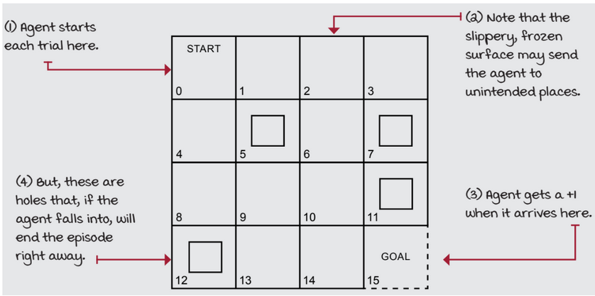

# MONTE CARLO CONTROL ALGORITHM

## AIM
To develop a Python program to find the optimal policy for the given RL environment using the Monte Carlo algorithm.

## PROBLEM STATEMENT
The FrozenLake environment in OpenAI Gym is a gridworld problem that challenges reinforcement learning agents to navigate a slippery terrain to reach a goal state while avoiding hazards. Note that the environment is closed with a fence, so the agent cannot leave the gridworld.

#### States:

*  5 Terminal States :
     
    *  G (Goal): The state the agent aims to reach.
    *  H (Hole): A hazardous state that the agent must avoid at all costs.
* 11 Non-terminal States:
    *    S (Starting state): The initial position of the agent.
    *    Intermediate states: Grid cells forming a layout that the agent must traverse.

#### Actions:

The agent has 4 possible actions:

  *   0: Left
  *   1: Down
  *  2: Right
   *  3: Up

#### Transition Probabilities:

Slippery surface with a 33.3% chance of moving as intended and a 66.6% chance of moving in orthogonal directions. For example, if the agent intends to move left, there is a

*  33.3% chance of moving left, a
* 33.3% chance of moving down, and a
*   33.3% chance of moving up.

#### Rewards:

The agent receives a reward of 1 for reaching the goal state, and a reward of 0 otherwise.
#### Graphical Representation:

## MONTE CARLO CONTROL ALGORITHM


 1.    Initialize the state value function V(s) and the policy π(s) arbitrarily.

 2.   Generate an episode using π(s) and store the state, action, and reward sequence.

  3.  For each state s appearing in the episode:

*  G ← return following the first occurrence of s
    Append G to Returns(s)
    V(s) ← average(Returns(s))

  4.  For each state s in the episode:

  *  π(s) ← argmax_a ∑_s' P(s'|s,a)V(s')

  5.  Repeat steps 2-4 until the policy converges.

  6.  Use the function decay_schedule to decay the value of epsilon and alpha.

  7.  Use the function gen_traj to generate a trajectory.

  8.  Use the function tqdm to display the progress bar.

  9.  After the policy converges, use the function np.argmax to find the optimal policy. The function takes the following arguments:

  *  Q: The Q-table.
  *  axis: The axis along which to find the maximum value.


## MONTE CARLO CONTROL FUNCTION
```
import numpy as np
from tqdm import tqdm

def mc_control(env, gamma=1.0, init_alpha=0.5, min_alpha=0.01, alpha_decay_ratio=0.5,
               init_epsilon=1.0, min_epsilon=0.1, epsilon_decay_ratio=0.9,
               n_episodes=3000, max_steps=200, first_visit=True):

    # Get the number of states and actions
    nS, nA = env.observation_space.n, env.action_space.n

    # Create an array for discounting
    disc = np.logspace(0, max_steps, num=max_steps, base=gamma, endpoint=False)

    def decay_schedule(init_value, min_value, decay_ratio, n):
        return np.maximum(min_value, init_value * (decay_ratio ** np.arange(n))

    # Create schedules for alpha and epsilon decay
    alphas = decay_schedule(init_alpha, min_alpha, alpha_decay_ratio, n_episodes)
    epsilons = decay_schedule(init_epsilon, min_epsilon, epsilon_decay_ratio, n_episodes)

    # Initialize Q-table and tracking array
    Q = np.zeros((nS, nA), dtype=np.float64)
    Q_track = np.zeros((n_episodes, nS, nA), dtype=np.float64)

    def select_action(state, Q, epsilon):
        return np.argmax(Q[state]) if np.random.random()>epsilon else np.random.randint(nA)

    for e in tqdm(range(n_episodes), leave=False):
        # Generate a trajectory
        traj = gen_traj(select_action, Q, epsilons[e], env, max_steps)
        visited = np.zeros((nS, nA), dtype=np.bool)

        for t, (state, action, reward, _, _) in enumerate(traj):
            if visited[state][action] and first_visit:
                continue
            visited[state][action] = True

            n_steps = len(traj[t:])
            G = np.sum(disc[:n_steps] * traj[t:, 2])
            Q[state][action] = Q[state][action] + alphas[e] * (G - Q[state][action])

        Q_track[e] = Q

    # Calculate the value function and policy
    V = np.max(Q, axis=1)
    pi = {s: np.argmax(Q[s]) for s in range(nS)}

    return Q, V, pi
```
##  PROGRAM TO EVALUATE THE POLICY:
```
import random
import numpy as np

def probability_success(env, pi, goal_state, n_episodes=100, max_steps=200, seed=123):
    random.seed(seed)
    np.random.seed(seed)
    env.seed(seed)
    results = []

    for _ in range(n_episodes):
        state, done, steps = env.reset(), False, 0
        while not done and steps < max_steps:
            action = pi[state]
            state, _, done, _ = env.step(action)
            steps += 1
        results.append(state == goal_state)

    success_rate = np.sum(results) / len(results)
    return success_rate

def mean_return(env, pi, n_episodes=100, max_steps=200, seed=123):
    random.seed(seed)
    np.random.seed(seed)
    env.seed(seed)
    results = []

    for _ in range(n_episodes):
        state, done, steps = env.reset(), False, 0
        returns = 0.0
        while not done and steps < max_steps:
            action = pi[state]
            state, reward, done, _ = env.step(action)
            returns += reward
            steps += 1
        results.append(returns)

    average_return = np.mean(results)
    return average_return

def results(env, optimal_pi, goal_state, seed=123):
    success_rate = probability_success(env, optimal_pi, goal_state=goal_state, seed=seed)
    avg_return = mean_return(env, optimal_pi, seed=seed)
    
    print(f'Reaches goal {success_rate:.2%}. 
  			Obtains an average undiscounted return of: {avg_return:.4f}.')

goal_state = 15
results(env, optimal_pi, goal_state=goal_state)
```
## OUTPUT:
### Optimal Value Function :

### Action Value Function :

### State Value Function :

### Success Rate for Optimal Policy :


## RESULT:

Thus a Python program is developed to find the optimal policy for the given RL environment using the Monte Carlo algorithm.
